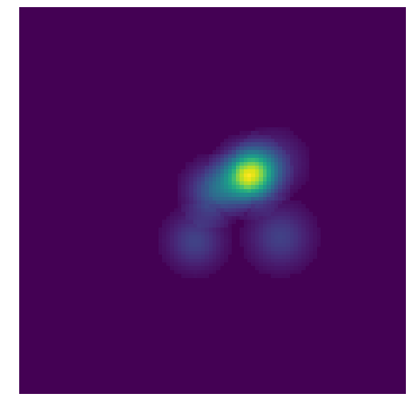

Usage of PyCupid Interfaces of Cupid's Clumping Algorithms
==========================================================

.. code:: python

    from pycupid import clumpfind, fellwalker, reinhold, gaussclumps
    from astropy.io import fits
    import numpy as np
    import numpy.ma as ma
    import matplotlib.pyplot as plt
    
    def estimate_rms(data):
        """
        Computes RMS value of an N-dimensional numpy array
        """
    
        if isinstance(data, ma.MaskedArray):
            ret = np.sum(data*data) / (np.size(data) - np.sum(data.mask)) 
        else: 
            ret = np.sum(data*data) / np.size(data)
        return np.sqrt(ret)
    
    def load_data(fits_path):
        hdulist = fits.open(fits_path)
        data = hdulist[0].data
        # droping out the stokes dimension
        data = np.ascontiguousarray(data[0])
        
        # in case NaN values exist on cube
        mask = np.isnan(data)
        if np.any(mask): data = ma.masked_array(data, mask=mask)
    
        # map to 0-1 intensity range
        data -= data.min()
        data /= data.max()
        
        if data.shape[0]==1:
            data = np.ascontiguousarray(data[0])
            if np.any(mask): 
                mask = np.ascontiguousarray(mask[0])
                data = ma.masked_array(data, mask=mask)
        return data

Loading FITS data
-----------------

.. code:: python

    data = load_data('Orion.cont.image.fits')
    rms = estimate_rms(data)

GaussClump
----------

.. code:: python

    out_gc = gaussclumps(data, 0.5*rms)

.. code:: python

    out_gc[out_gc==out_gc.min()] = 0.

.. code:: python

    plt.figure(figsize=(10,10))
    plt.imshow(out_gc)
    plt.axis('off')
    plt.show()

ClumpFind
---------

.. code:: python

    out_cf = clumpfind(data, 0.5*rms)

.. code:: python

    out_cf[out_cf==out_cf.min()] = 0.

.. code:: python

    plt.figure(figsize=(10,10))
    plt.imshow(out_cf)
    plt.axis('off')
    plt.show()

FellWalker
----------

.. code:: python

    out_fw = fellwalker(data, 0.5*rms)

.. code:: python

    out_fw[out_fw==out_fw.min()] = 0.

.. code:: python

    plt.figure(figsize=(10,10))
    plt.imshow(out_fw)
    plt.axis('off')
    plt.show()

Reinhold
--------

.. code:: python

    out_rh = reinhold(data, 0.5*rms)

.. code:: python

    out_rh[out_rh==out_rh.min()] = 0.

.. code:: python

    plt.figure(figsize=(10,10))
    plt.imshow(out_rh)
    plt.axis('off')
    plt.show()

